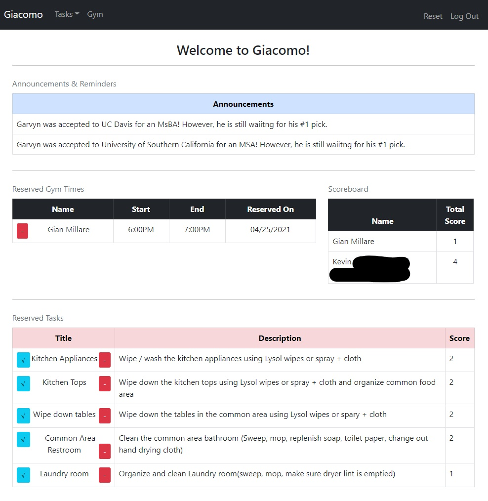
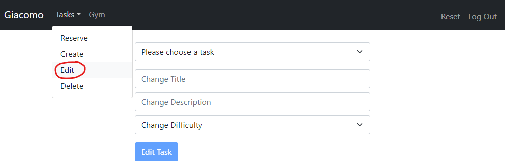
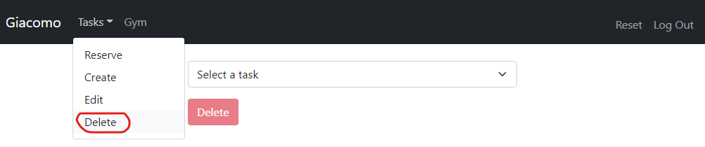
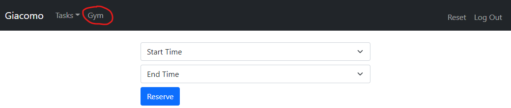
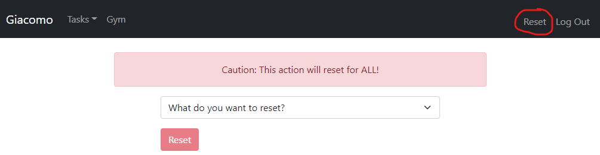

# Giacomo_Tasks

This app is called "Giacomo", named after the street that my good friends and I live on. It was initially created to organize household chores, but eventually evolved to perform other functions. The below items are a list of what this app will enable my housemates and I to do:

 - Create, Delete, Edit, and Reserve chores 

 - Reserve gym (weight room) time 

 - View and edit a grocery list 

 - View Contact / Social links of housemates and important contacts (i.e. landlord, etc.) 

 - View a house-wide 'announcement' banner containing important announcements. 

 - Reset all lists in the application. 

 - And more... ? 

### Users are first greeted by a Login Page. New Users will need to register.

 

### The register page consists of submitting a full name, username, password, and password confirmation. These metrics are purely for back end usage.

 

### Once logged in, the user will enter the homepage. Here, various things are viewable: announcements, reserved chores, completed chores, reserved gym times, grocery list, anc a contact list.

 

### Clicking on Tasks -> Reserve will bring a user to a chore reservation screen. This is where users can choose a chore they would like to complete.

 

### If a new task needs to be added to the house, users have an option of creating a new task for the entire house to view.

 

### Users also have the option to re-configure a task by selecting the "edit" option under "Tasks".

 

### If a task is to be discontinued, users can select the "Delete" option to completely remove the task from the application.

 

### By clicking on the "Gym" option, users can reserve a duration of time to use the homemade gym in our garage.

 

### The "Reset" button acts as a "self-desstruct" button that resets all lists (chores, gym times, etc).

 

